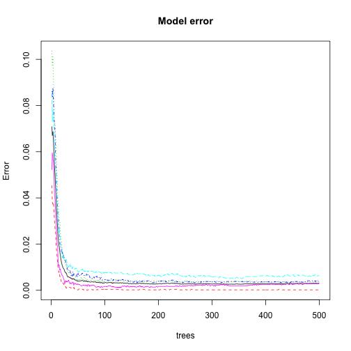
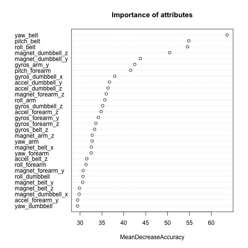

Activity Recognition using Random Forest Algorithm
========================================================

The goal of this project is develop a predict model to identify which activity a person was performed. The data used were from accelerometers on the belt, forearm, arm and dumbell. More specifically, the goal of this project is test if it is possible develop a acurate predict model for this problem using only Random Forest Algorithm [[1]](ftp://131.252.97.79/Transfer/Treg/WFRE_Articles/Liaw_02_Classification%20and%20regression%20by%20randomForest.pdf).

The dataset used in this work was [[2]](http://groupware.les.inf.puc-rio.br/static/WLE/WearableComputing_weight_lifting_exercises_biceps_curl_variations.csv) and the paper that describe the dataset can be found at [[3]](http://groupware.les.inf.puc-rio.br/public/papers/2013.Velloso.QAR-WLE.pdf).

This report is organized as follow: the first section describes the acquisition and pre-processing data; the next section describes the modeling of the predictive model, and; the last section describes the evaluation of the predictive model.

Acquisition and pre-processing data
-----------------------------------

I imported the dataset as follow:


```r
set.seed(1234)
options(stringsAsFactors = TRUE)
training <- read.csv("../data/pml-training.csv", header = TRUE)
training$X <- NULL
```


This dataset has 19622 examples and 159 attributes. However, some attributes are irrelevant as predictors, for example: user\_name, raw\_timestamp\_part\_1, raw\_timestamp\_part_2, cvtd\_timestamp, new\_window and num\_window. Therefore, I will remove these attributes from the dataset.


```r
f_training <- training
f_training$user_name <- NULL
f_training$raw_timestamp_part_1 <- NULL
f_training$raw_timestamp_part_2 <- NULL
f_training$cvtd_timestamp <- NULL
f_training$new_window <- NULL
f_training$num_window <- NULL
```


Besides, there some attributes with NA values. Random Forest Algorithm can not handle attributes with NA values. Therefore, I removed these attributes from the dataset using the command below:


```r
f_training <- f_training[, colSums(is.na(f_training)) == 0]
```


For some reason, there are some attributes that were imported without values
and as character type. In this case, I removed manually each attribute using the commands
below:


```r
f_training$kurtosis_roll_belt <- NULL
f_training$kurtosis_picth_belt <- NULL
f_training$kurtosis_yaw_belt <- NULL
f_training$skewness_roll_belt <- NULL
f_training$skewness_roll_belt.1 <- NULL
f_training$skewness_yaw_belt <- NULL
f_training$max_yaw_belt <- NULL
f_training$min_yaw_belt <- NULL
f_training$amplitude_yaw_belt <- NULL
f_training$kurtosis_roll_arm <- NULL
f_training$kurtosis_picth_arm <- NULL
f_training$kurtosis_yaw_arm <- NULL
f_training$skewness_roll_arm <- NULL
f_training$skewness_pitch_arm <- NULL
f_training$skewness_yaw_arm <- NULL
f_training$kurtosis_roll_dumbbell <- NULL
f_training$kurtosis_picth_dumbbell <- NULL
f_training$kurtosis_yaw_dumbbell <- NULL
f_training$skewness_roll_dumbbell <- NULL
f_training$skewness_pitch_dumbbell <- NULL
f_training$skewness_yaw_dumbbell <- NULL
f_training$max_yaw_dumbbell <- NULL
f_training$min_yaw_dumbbell <- NULL
f_training$amplitude_yaw_dumbbell <- NULL
f_training$kurtosis_roll_forearm <- NULL
f_training$kurtosis_picth_forearm <- NULL
f_training$kurtosis_yaw_forearm <- NULL
f_training$skewness_roll_forearm <- NULL
f_training$skewness_pitch_forearm <- NULL
f_training$skewness_yaw_forearm <- NULL
f_training$max_yaw_forearm <- NULL
f_training$min_yaw_forearm <- NULL
f_training$amplitude_yaw_forearm <- NULL
```


After pre-processing step, the dataset has 19622 examples and 53 attributes. 

Modeling
--------

In this work I used the randomForest package [[4]](http://cran.r-project.org/web/packages/randomForest/index.html) for developing the model that predict the _classe_ value. Besides, I used all the other attributes to build the model.

The code bellow create a variable model. This code is not executed in this script because it takes long time to finish.


```r
set.seed(1234)
library(randomForest)
model <- randomForest(classe ~ ., data = f_training, importance = TRUE, do.trace = 100)
```


Instead of build the model here, I will load it in memory as follow:


```r
library(randomForest)
```

```
## randomForest 4.6-7
## Type rfNews() to see new features/changes/bug fixes.
```

```r
load("../data/model.Rda")
```


In the next section I will examine the accuracy of the model.

Evaluation
----------

The model developed has 500 trees and at each split seven variables are used.


```r
model
```

```
## 
## Call:
##  randomForest(formula = classe ~ ., data = f_training, importance = TRUE,      do.trace = 100) 
##                Type of random forest: classification
##                      Number of trees: 500
## No. of variables tried at each split: 7
## 
##         OOB estimate of  error rate: 0.31%
## Confusion matrix:
##      A    B    C    D    E class.error
## A 5578    2    0    0    0   0.0003584
## B   10 3783    4    0    0   0.0036871
## C    0   12 3408    2    0   0.0040912
## D    0    0   19 3195    2   0.0065299
## E    0    0    2    8 3597   0.0027724
```


An estimate of the error rate can be obtained, based on the training data, by the following: (i) at each boostrap iteration, predict the data not in the bootstrap sample (calls "out-of-bag", or OOB, data) using the tree grown with the boostrap sample, and; (ii) aggregate the OOB predictions and calculate the error rate, and call it the OOB estimate error rate [[1]](ftp://131.252.97.79/Transfer/Treg/WFRE_Articles/Liaw_02_Classification%20and%20regression%20by%20randomForest.pdf).

The OOB estimate of error rate for this model is:


```r
model$err.rate[500, 1]
```

```
##      OOB 
## 0.003109
```


In other words, 0.3109%. The confusion matrix can be calculated in the same way. Bellow you can see the confusion matrix. As you can see, the results are very good for all classes. 


```r
model$confusion
```

```
##      A    B    C    D    E class.error
## A 5578    2    0    0    0   0.0003584
## B   10 3783    4    0    0   0.0036871
## C    0   12 3408    2    0   0.0040912
## D    0    0   19 3195    2   0.0065299
## E    0    0    2    8 3597   0.0027724
```


Another relevante information is the accuracy of each type of model with different number of trees. The final model has 500 trees, but, as the plot bellow suggest, I can use a model with only 200 trees and have the same level of accuracy.


```r
plot(model, main = "Model error")
```

 


The next plot shows how important is each attributes in classifying the data. The most important attributes are yaw\_belt, pitch\_belt and rool\_belt. 


```r
varImpPlot(model, type = 1, main = "Importance of attributes")
```

 


**Taking into account the above data I believe that this model can classify new data with high accuracy**.
